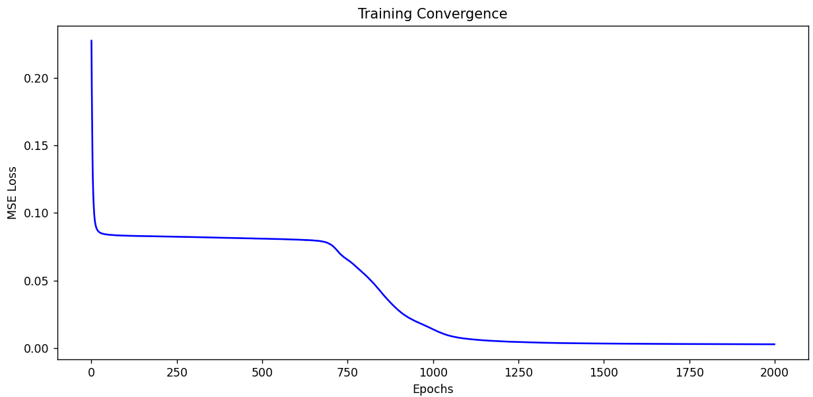

# Handcrafted Neural Network from Scratch

A personal implementation of a fully connected neural network built from the ground up using only Python and NumPy, without relying on high-level frameworks like TensorFlow or Keras. The core logic was implemented manually as a learning exercise, with the goal of keeping the code clear and educational.

## Features

*   **Customizable Architecture:** Support for any number of hidden layers and neurons.
*   **Activation Functions:** Manual implementation of `Sigmoid` and `Hyperbolic Tangent (tanh)` with their respective derivatives.
*   **Bias Integration:** Automatic handling of bias units through matrix concatenation.
*   **Weight updates via backpropagation:** Using stochastic gradient descent.
*   **Loss Function:** Mean Squared Error (MSE) with loss curve visualization using Matplotlib.

## How it Works

The network follows the standard forward and backward pass of a neural network:
1. **Linear Combination:** $z = w \cdot x + b$
2. **Activation:** $a = f(z)$
3. **Backpropagation:** Computing deltas for each layer using the chain rule to update weights.

## Current Architecture

*    **5 layers**: 10 (input) - 32 (hidden) - 16 (hidden) - 8 (hidden) - 3 (output)
*    Inputs: 10 binary numbers (0/1)
*    Outputs: 3 continuous values (float), interpreted according to the target task
*    Activation function: **tanh**
*    Bias neurons included in each layer
*    This simple implementation supports only fully connected architectures

## Output layer after training with the example dataset:

*    Neuron 1: learns to approximate parity (whether the sum of the 10 inputs is odd)  
*    Neuron 2: learns to replicate the first input (identity)  
*    Neuron 3: learns to approximate the mean of bits 6 and 7  

## Requirements

*   Python 3.x
*   NumPy
*   Matplotlib (for cost visualization)

## Usage

To train the model with the provided dataset, **nn_training.csv**, run `python main.py`

There is also a complete data set included with all 1024 bit combinations, **nn_training_complete.csv**.

You can create your own data sets for your own learning objectives, to see how it works.

## Empirical Analysis

Initial experiments with shallow architectures (single hidden layer) showed strong performance on linear tasks (identity and averaging) but clear limitations when dealing with the parity problem (predicting whether the sum of inputs is even or odd). After increasing both network depth and width, the model was able to successfully learn all three targets simultaneously.

This is the actual output of the last run before updating this document:

```bash
$ python main.py
Starting training...
Epoch: 0, Loss: 0.351270
Epoch: 500, Loss: 0.014415
Epoch: 1000, Loss: 0.003412
Epoch: 1500, Loss: 0.002112

--- Individual Testing ---
Test: [1. 1. 0. 0. 1. 0. 1. 0. 1. 1.] | Res: [0.  1.  0.5] | Pred: [0.01296921 0.99937636 0.49723467]
Test: [0. 1. 1. 1. 0. 1. 1. 0. 0. 0.] | Res: [1. 0. 1.] | Pred: [0.95967745 0.01305338 0.9906855 ]
Test: [1. 1. 1. 0. 0. 0. 0. 1. 0. 0.] | Res: [0. 1. 0.] | Pred: [-0.01445972  0.99928225  0.01381824]
Test: [0. 0. 0. 1. 1. 0. 1. 1. 1. 0.] | Res: [1.  0.  0.5] | Pred: [ 0.99097939 -0.00226378  0.4649177 ]
Test: [1. 0. 1. 0. 1. 1. 1. 1. 0. 0.] | Res: [0. 1. 1.] | Pred: [-0.03957094  0.99862741  0.99401581]
Test: [0. 1. 0. 1. 0. 0. 0. 0. 1. 1.] | Res: [0. 0. 0.] | Pred: [ 0.01997001  0.01582923 -0.00144474]
Test: [1. 0. 0. 1. 1. 1. 0. 1. 1. 0.] | Res: [0.  1.  0.5] | Pred: [-0.0559294   0.99938861  0.4986901 ]
Test: [0. 0. 1. 1. 0. 0. 1. 0. 0. 1.] | Res: [0.  0.  0.5] | Pred: [-0.0040255   0.00064168  0.4989355 ]
Test: [1. 1. 0. 1. 0. 1. 0. 1. 0. 1.] | Res: [0.  1.  0.5] | Pred: [-0.0414534   0.99934653  0.53402772]
Test: [0. 1. 1. 0. 1. 0. 0. 1. 1. 1.] | Res: [0. 0. 0.] | Pred: [-0.02403049  0.0070436   0.00201185]
```

### Learning curve 


